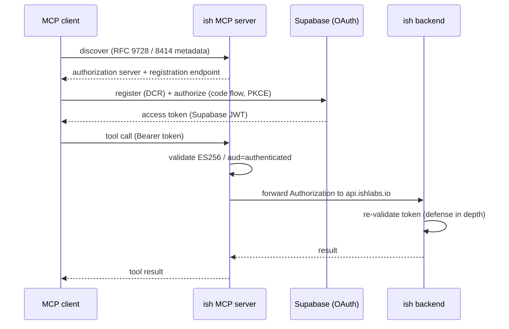

The hosted ish MCP server signs clients in over OAuth and forwards the resulting token to
the ish backend. You never paste a token into a config file. For the steps to add the
server and sign in, see [Connecting](/mcp/connecting); this page documents the auth
machinery behind it.

## How sign-in works

The server validates every inbound request and acts as an OAuth resource server.

**Validation.** Inbound Supabase access tokens are verified as ES256 against the project's
JWKS, with audience `authenticated`. The backend re-validates the same token, so a request
is checked twice (defense in depth).

**Discovery.** The server advertises Supabase as its authorization server using two
discovery documents: OAuth 2.0 Protected Resource metadata (RFC 9728) at
`/.well-known/oauth-protected-resource`, and Authorization Server metadata (RFC 8414) at
`/.well-known/oauth-authorization-server`. Supabase serves its OAuth metadata at
`/.well-known/openid-configuration` rather than the RFC 8414 path, so the server forwards
the OIDC document at the RFC 8414 path and injects a `registration_endpoint` (Supabase's
Dynamic Client Registration endpoint, which the OIDC document omits).

That metadata is what lets a client (Claude Code, Cursor, and others) bootstrap sign-in
with no pre-issued token: it discovers Supabase, registers itself over Dynamic Client
Registration, runs the OAuth code flow, and presents the resulting access token to the
server.

## OAuthProxy

The server fronts Supabase with a FastMCP `OAuthProxy` instead of pointing clients straight
at Supabase.

**Why it exists.** Supabase's OAuth server validates `redirect_uri` by exact string match
and does not implement the RFC 8252 loopback exception (where an auth server ignores the
port for `http://127.0.0.1` and `http://localhost` redirects). A client that binds a fresh
ephemeral loopback port per session, with VS Code being the notable one, reuses a cached
registered `client_id` whose `redirect_uris` no longer match the port it bound, so Supabase
rejects the authorize request with `invalid redirect_uri`. Cursor, Claude Code, and the app
builders keep a consistent redirect through register, authorize, and callback, so they never
hit this.

<Note>
  The proxy is why VS Code and other ephemeral-loopback-port clients sign in at all. Without
  it, a cached `client_id` whose registered ports no longer match would fail at the authorize
  step. You do not configure any of this; the client picks its port and the proxy absorbs it.
</Note>

**What the proxy does.** It advertises this server as the authorization server, presents a
full Dynamic Client Registration interface that accepts any loopback port, and holds one
fixed redirect registered with Supabase. It translates between the client's dynamic loopback
URI and the fixed upstream one, so every client works regardless of how it picks its
redirect. The proxy runs its own PKCE leg upstream (S256). It does not forward RFC 8707
resource indicators, since Supabase does not implement them.

## Token forwarding

Tools never read headers or the local config directly. Each tool obtains the
`Authorization` header to send to `api.ishlabs.io` through a single chokepoint.

The forwarded token is the validated access token, which is the upstream Supabase JWT. The
inbound bearer is a short reference token the proxy mints to the client; the proxy resolves
it server-side to the stored upstream Supabase JWT, and that JWT is what gets forwarded. If
the resolved access-token context is unavailable, the server forwards the inbound
`Authorization` header verbatim; a request with no bearer is rejected.

The backend re-validates whatever token it receives, so forwarding is defense in depth
rather than the only check.

## Confirm the session

Read the [`ish://identity/me`](/mcp/generated/resources) resource, or call a read-only tool
like `workspace_get`, to see whose account the session is acting as. A read draws no
credits. See [Connecting](/mcp/connecting#confirm-the-connection) for the full check.

## See also

<Columns cols={3}>
  <Card title="Connecting" icon="/images/logos/mcp.svg" href="/mcp/connecting">
    Add the server to your client and sign in, step by step.
  </Card>
  <Card title="Tool conventions" icon="route" href="/mcp/tool-conventions">
    Naming, id prefixes, polymorphism, and safety annotations.
  </Card>
  <Card title="MCP resources" icon="folder-open" href="/mcp/generated/resources">
    Session and reference data, including `ish://identity/me`.
  </Card>
</Columns>
